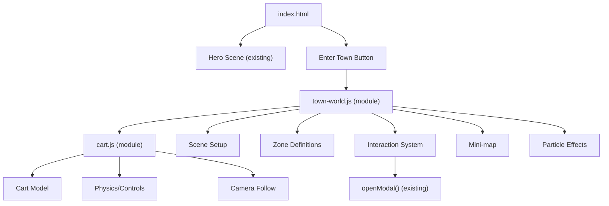

# 🏘️ Portfolio.md
### A 3D Isekai Town Experience

Welcome to the **Ayush Settlement**, an interactive 3D web experience built with modern JavaScript and a touch of another world. This project serves as a personal playground for exploring 3D environments, physics-based interactions, and Progressive Web App (PWA) features.

---

## 🌐 [Live Demo](https://ayushmaria.github.io/)

---

## Architecture Diagram



---

## 🚀 Current Status: Phase 1
We have successfully transitioned from a static void into a living settlement.

* **3D World Construction:** A fully rendered Isekai-style town environment.
* **The Cart System:** A physics-driven drivable cart implemented in `cart.js`.
* **Mobile Ready:** Full PWA support via `manifest.json`, making the settlement accessible as a standalone app.
* **Optimized Performance:** Cleaned up redundant files and streamlined CSS for faster rendering.

---

## 🛠️ Tech Stack
* **HTML5 / CSS3:** Custom styling including `town-styles.css`.
* **JavaScript (Vanilla):** Logic for world-building (`town-world.js`) and vehicle mechanics (`cart.js`).
* **Deployment:** Hosted via GitHub Pages / Vercel.

---

## 📂 Project Structure
* **`index.html`**: The entry point to the settlement.
* **`cart.js`**: Handles the steering, acceleration, and "cart-physics."
* **`town-world.js`**: The architect of the 3D town environment.
* **`implementation_plan.md`**: Our roadmap for future town expansions.

---

## 🏗️ Getting Started
If you'd like to run this settlement locally:

1. **Clone the repo:**
   ```bash
   git clone [https://github.com/AyushMaria/ayushmaria.github.io.git](https://github.com/AyushMaria/ayushmaria.github.io.git)

---

## Open the gates:
Simply open index.html in your favorite browser (or use a Live Server extension in VS Code for the best experience).

---

## 🗺️ Roadmap
[x] Phase 1: 3D Town & Drivable Cart.
[ ] Phase 2: Isekai Aesthetic Upgrades.
[ ] Phase 3: Interaction System.
