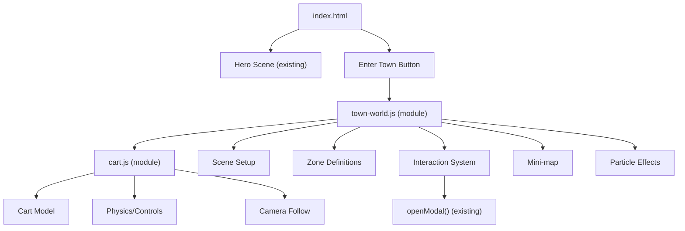

# 3D Isekai Town with Drivable Cart — Implementation Plan

## Current State

Your portfolio already has a strong foundation: a Three.js hero scene with a Torii gate, and a 3D town world (triggered by "Enter Town") with labeled buildings across 4 zones (Town Square, Settlement, Research, Tavern). Navigation is currently **HUD button-based** — you click a zone and the camera flies there via GSAP.

````carousel

<!-- slide -->

````

## Goal

Transform the 3D town into a **fully navigable isekai village** where the user drives a medieval fantasy cart along winding roads between buildings. Instead of clicking HUD buttons, users **steer the cart** with keyboard/mouse to explore.

---

## User Review Required

> [!IMPORTANT]
> **Scope & Performance Trade-offs**: A full 3D drivable world in vanilla Three.js (no bundler, no React Three Fiber) will be a significant single-file implementation (~500+ lines of new JS). The current site is already ~2000 lines. We have two options:
> 1. **Option A — Keep single-file architecture** (current `index.html` approach). Simpler to deploy on GitHub Pages, but the file gets very large.
> 2. **Option B — Split into modules** using ES module `<script type="module">` with separate `.js` files. Cleaner code but slightly more complex file structure.
>
> **Recommendation:** Option B for maintainability. The town world script alone will be 400+ lines.

> [!WARNING]
> **Mobile Compatibility**: A drivable cart requires keyboard input (WASD/arrows). On mobile, we'd need on-screen joystick controls. This adds complexity. **Do you want mobile cart driving, or should mobile fall back to the current HUD button navigation?**

> [!IMPORTANT]
> **Three.js Version**: You're currently on `r128` (2021). For better performance and modern features (instanced rendering, better shadows), we should upgrade to `r160+`. This is a low-risk change but may require minor API adjustments.

---

## Proposed Changes

### Phase 1: Scene & Terrain Overhaul

#### [NEW] [town-world.js](file:///e:/ayush-settlement/town-world.js)
The main 3D town engine, extracted from the inline `initTownWorld()` function and massively expanded:

- **Terrain**: Replace flat plane with a textured, slightly undulating ground using vertex displacement. Add grass patches (instanced mesh clusters), dirt road paths between zones, and a river/stream with animated water shader.
- **Sky**: Add a procedural sky dome (gradient shader) that responds to day/night theme toggle. Include volumetric fog and particle-based clouds.
- **Road System**: Define a spline-based road network (THREE.CatmullRomCurve3) connecting all zones. The cart follows/is constrained near these roads. Roads have cobblestone texture via repeating UV material.

#### [NEW] [cart.js](file:///e:/ayush-settlement/cart.js)
Drivable cart system:

- **Cart Model**: Procedurally built from Three.js primitives — wooden plank body, 4 rotating wheels (torus geometry), a canopy (curved plane), lantern hanging from front post (point light that sways). Anime/isekai-inspired proportions (slightly chibi/chunky).
- **Physics**: Lightweight custom physics (no Cannon.js dependency to keep it light):
  - Forward/backward velocity with acceleration/deceleration
  - Steering angle with smooth interpolation
  - Simple ground-following (raycast down to terrain)
  - Collision with building bounding boxes (push-back response)
- **Controls**:
  - `W`/`↑` = accelerate forward
  - `S`/`↓` = brake/reverse
  - `A`/`←` = steer left
  - `D`/`→` = steer right
  - `Space` = handbrake (drift-stop)
- **Camera**: Third-person follow camera with spring-arm behavior:
  - Smooth lerp behind the cart
  - Elevation based on speed (cinematic feel)
  - Mouse-drag to orbit around cart temporarily
  - Snap back to behind-cart when mouse released

#### [MODIFY] [index.html](file:///e:/ayush-settlement/index.html)
- Remove the inline `initTownWorld()` script block (~400 lines)
- Add `<script type="module">` imports for the new modules
- Update the "Enter Town" button handler to initialize the new cart-based world
- Add an on-screen **controls hint overlay** (fades out after 5 seconds):
  ```
  ┌─────────────────────────┐
  │  🎮 CART CONTROLS       │
  │  W/↑  Forward           │
  │  S/↓  Brake             │
  │  A/←  Steer Left        │
  │  D/→  Steer Right       │
  │  CLICK  Interact        │
  └─────────────────────────┘
  ```
- Keep the HUD zone buttons as **fast-travel** (auto-drives cart along the road spline to target zone)
- Update Three.js CDN from r128 → r160+

---

### Phase 2: Isekai Aesthetic Upgrades

#### [MODIFY] [town-world.js](file:///e:/ayush-settlement/town-world.js)
Enhanced visual details for each zone:

**Town Square:**
- Animated fountain with particle water spray
- Wooden sign posts with hand-painted text textures
- Flower beds (instanced colored planes with wind sway)
- NPC silhouettes (flat billboard sprites) that wave when cart is near

**Settlement (Main Street):**
- Buildings get more architectural detail: timber framing lines (edge geometry), flower boxes under windows, swinging inn signs
- Smoke particles rising from chimneys (The Forge, Ledger Sanctum)
- Street lined with barrels, crates, and hanging lanterns
- Wooden market stalls between buildings

**Research Quarter:**
- Glowing rune circles on the ground (animated ring geometry with emissive shader)
- Floating books/crystals orbiting the Vortex Observatory
- Lightning particle effects between towers
- Misty/eerie fog density higher here

**Tavern:**
- Warm interior light spilling from windows (volumetric cone lights)
- Mugs and plates on outdoor tables
- A bard's stage with a musical note particle emitter
- Cozy campfire with animated flame (billboard sprite sheet or shader)

---

### Phase 3: Interaction System

#### [MODIFY] [town-world.js](file:///e:/ayush-settlement/town-world.js)
- **Proximity Detection**: When cart is within ~5 units of a building, show a floating `[E] Enter` prompt (CSS2D label)
- **Building Entry**: Press `E` or click when near a building → opens the existing modal system (`openModal(projectId)`)
- **Cart Animation**: Cart does a little "park" animation (turns slightly toward building, lantern brightens)
- **Mini-map**: Add a 2D top-down mini-map in the corner showing:
  - Cart position (animated dot)
  - Building locations (icons)
  - Road paths (lines)
  - Current zone highlight

---

### Phase 4: Polish & Effects

#### [MODIFY] [style.css](file:///e:/ayush-settlement/style.css)
- Add styles for the controls overlay HUD
- Mini-map container styles
- Building interaction prompt animations
- Speed-lines overlay effect when cart is going fast
- Cart dust particle trail CSS (as fallback for low-end devices)

#### [MODIFY] [town-world.js](file:///e:/ayush-settlement/town-world.js)
- **Particle Systems**:
  - Dust trail behind cart wheels
  - Fireflies at night (already exists in hero, extend to town)
  - Leaves blowing across the road
- **Audio Integration**: Tie into existing ambient sound system:
  - Cart wheel creaking sound (procedural oscillator)
  - Clip-clop if you want a horse-drawn feel
  - Zone-specific ambience changes as you drive between areas
- **Day/Night Cycle**: Smooth transition when theme toggle is clicked:
  - Sun position moves, sky color shifts
  - Lanterns turn on/off
  - Window glow intensity changes
  - Fireflies appear/disappear

---

## Architecture Diagram



---

## Open Questions

> [!IMPORTANT]
> 1. **Single file vs modules?** (Option A vs B above) — I recommend Option B.
> 2. **Mobile support** — Full joystick or fallback to HUD buttons on touch devices?
> 3. **Horse or no horse?** — Should the cart be pulled by a simple chibi horse/donkey, or self-propelled (magic cart)?
> 4. **Three.js upgrade** — Are you okay upgrading from r128 to r160+?
> 5. **Do you want screenshots/images of buildings?** — I can generate reference images for the isekai aesthetic you're going for, but it would be purely for inspiration — the actual implementation will be procedural Three.js geometry (not image textures).

---

## Verification Plan

### Automated Tests
- Open site in browser subagent after each phase
- Verify cart responds to WASD keys
- Verify building click/proximity opens correct modal
- Test day/night toggle doesn't break town scene
- Test zone fast-travel buttons still work

### Manual Verification
- Performance check: target 60fps on mid-range hardware
- Mobile responsive check: controls hint and fallback
- Cross-browser: Chrome, Firefox, Edge
- Deploy to GitHub Pages and verify live
