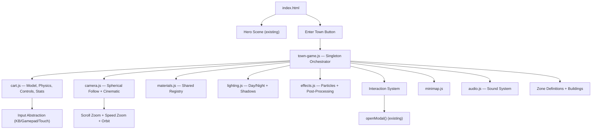

# 3D Isekai Town — Implementation Plan

> **Reference:** [AyushMaria/PortfolioInspo](https://github.com/AyushMaria/PortfolioInspo) (forked from Bruno Simon's award-winning [folio-2025](https://github.com/brunosimon/folio-2025))

Transform the 3D town into a **fully navigable isekai village** where the user drives a medieval fantasy cart along winding roads between buildings, adopting proven patterns from Bruno Simon's portfolio.

---

## Current State

A Three.js hero scene with a Torii gate, and a 3D town world (triggered by "Enter Town") with labeled buildings across 4 zones (Town Square, Settlement, Research, Tavern). Navigation is currently **HUD button-based** — you click a zone and the camera flies there via GSAP.

### Architecture Comparison

| Aspect | Bruno Simon (Reference) | Current Town | Target |
|--------|--------------------------|-------------|--------|
| **Build system** | Vite + npm modules | Vanilla HTML + CDN scripts | ES modules (no bundler) |
| **Three.js version** | `three/webgpu` (r170+, WebGPU) | r128 CDN (WebGL) | r160+ CDN (WebGL) |
| **Architecture** | Singleton `Game` class orchestrating 40+ modules | `initTownWorld()` function + `Cart` class | Singleton `TownGame` + modular files |
| **Physics** | Rapier 3D (`@dimforge/rapier3d`) | Custom bicycle-model + AABB | Custom physics (lightweight) |
| **Asset pipeline** | GLTF models + KTX compressed textures | Procedural geometry only | Procedural + optional GLTF |
| **Rendering** | Custom WebGPU + post-processing | Standard `WebGLRenderer` | `WebGLRenderer` + post-processing |
| **Camera** | Spherical coords, zoom, cinematic, speed-based | Basic lerp follow | Spherical + zoom + cinematic |
| **Materials** | Centralized registry with shared instances | New material per building | Shared materials map |
| **Events** | Priority-based event emitter | Direct function calls | Custom event emitter |
| **File count** | ~50 JS modules, ~20 styles | 4 files total | ~6-8 JS modules |

---

## Goal

Instead of clicking HUD buttons, users **steer the cart** with keyboard/mouse to explore. The town feels alive with animated lighting, particle effects, and interactive buildings — inspired by Bruno Simon's drivable portfolio experience, adapted for an isekai fantasy aesthetic.

---

## Core Patterns (from Bruno Simon Reference)

### 1. Singleton Orchestrator

Bruno's `Game` class is the central hub — all modules reference it via `Game.getInstance()`. This eliminates prop-drilling and enables clean modular separation.

```javascript
// town-game.js — Central orchestrator
export class TownGame {
    static instance = null;
    static getInstance() { return TownGame.instance; }

    constructor() {
        if (TownGame.instance) return TownGame.instance;
        TownGame.instance = this;
        this.scene = null;
        this.camera = null;
        this.renderer = null;
        this.cart = null;
        this.materials = null;
        this.events = null;
        // Initialize subsystems in order...
    }
}
```

### 2. Spherical Camera System

Bruno's camera uses spherical coordinates (`phi`, `theta`, `radius`) instead of hardcoded offsets. This enables smooth zoom, speed-based pullback, and cinematic transitions.

```javascript
this.spherical.phi = Math.PI * 0.27;    // elevation angle
this.spherical.theta = Math.PI * 0.25;  // rotation angle
this.spherical.radius = { min: 15, max: 30 };
```

Key features to adopt:
- **Scroll-wheel zoom** — lerp between min/max radius
- **Speed-based dynamic zoom** — pull camera back when cart moves fast
- **Cinematic mode** — smooth interpolation to preset camera positions (e.g., when entering buildings)
- **Mouse orbit** — temporary orbit around cart, snap back on release

### 3. Centralized Materials Registry

Bruno uses a `Map`-based material registry. Shared materials reduce draw calls and GPU memory.

```javascript
export const MATERIALS = new Map();
MATERIALS.set('wood', new MeshStandardMaterial({ color: 0x8B6914 }));
MATERIALS.set('stone', new MeshStandardMaterial({ color: 0x9E9E9E }));
// Reuse across all buildings instead of creating new instances
```

### 4. Priority-Based Event System

```javascript
events.on('tick', () => { physics.update(); }, 10);   // physics first
events.on('tick', () => { camera.update(); }, 20);     // camera second
events.on('tick', () => { particles.update(); }, 30);  // effects last
```

### 5. Player Enhancements (from Bruno's Player.js)

- **Input abstraction** — Named actions (`forward`, `backward`, `boost`) mapped to keyboard + gamepad + touch
- **Auto-unstuck** — Detect if cart is jammed for 3+ seconds, auto-nudge free
- **Stats tracking** — `distanceDriven`, `timePlayed` persisted to localStorage
- **Boost mechanic** — Shift key for speed boost with visual + audio feedback

---

## Phased Implementation

### Phase 1: Foundation & Cart System

#### [NEW] `town-game.js` — Singleton Orchestrator
- Central `TownGame` class holding `scene`, `camera`, `renderer`, `cart`, `materials`, `events`
- Async init: scene setup → terrain → buildings → cart → camera → particles → lighting
- Priority-based tick loop for update ordering

#### [NEW] `cart.js` — Drivable Cart
- **Cart Model**: Procedurally built from Three.js primitives — wooden plank body, 4 rotating wheels (torus geometry), canopy (curved plane), lantern hanging from front post (point light that sways). Isekai-inspired proportions (slightly chibi/chunky).
- **Physics**: Lightweight custom physics (no external dependency):
  - Forward/backward velocity with acceleration/deceleration
  - Steering angle with smooth interpolation
  - Ground-following via raycast
  - Collision with building bounding boxes (push-back response)
  - Auto-unstuck detection (3+ seconds stuck → nudge free)
- **Controls**:
  - `W`/`↑` = accelerate | `S`/`↓` = brake/reverse
  - `A`/`←` = steer left | `D`/`→` = steer right
  - `Space` = handbrake | `Shift` = boost (with visual + audio feedback)
  - Touch: on-screen joystick (or fallback to HUD buttons on mobile)
- **Stats**: Track `distanceDriven` and `timePlayed` in localStorage

#### [NEW] `camera.js` — Spherical Follow Camera
- Spherical coordinates (`phi`, `theta`, `radius`) instead of hardcoded offset
- Scroll-wheel zoom (lerp between radius min/max)
- Speed-based dynamic zoom (pull back when fast)
- Mouse-drag orbit (temporary, snaps back on release)
- Cinematic transitions when entering buildings (smooth lerp to preset position)

#### [MODIFY] `index.html`
- Remove inline `initTownWorld()` script block (~400 lines)
- Add `<script type="module">` imports for new modules
- Update "Enter Town" button to initialize `TownGame`
- Add controls hint overlay (fades out after 5s)
- Keep HUD zone buttons as **fast-travel** (auto-drives cart along road spline)
- Upgrade Three.js CDN from r128 → r160+

---

### Phase 2: Isekai Aesthetic & Visual Upgrades

#### [NEW] `materials.js` — Centralized Materials Registry
- `Map`-based registry of shared materials (wood, stone, roof, water, grass, etc.)
- Eliminates per-building `new MeshStandardMaterial()` — major perf win
- Named access: `MATERIALS.get('wood')`

#### [MODIFY] `town-game.js` — Zone Visual Details

**Town Square:**
- Animated fountain with particle water spray
- Wooden sign posts with hand-painted text textures
- Flower beds (instanced colored planes with wind sway)
- NPC silhouettes (flat billboard sprites) that wave when cart is near

**Settlement (Main Street):**
- Timber framing lines, flower boxes under windows, swinging inn signs
- Smoke particles rising from chimneys (The Forge, Ledger Sanctum)
- Street barrels, crates, hanging lanterns
- Wooden market stalls between buildings

**Research Quarter:**
- Glowing rune circles on ground (animated ring geometry with emissive shader)
- Floating books/crystals orbiting the Vortex Observatory
- Lightning particle effects between towers
- Misty/eerie fog density higher here

**Tavern:**
- Warm interior light spilling from windows (volumetric cone lights)
- Mugs and plates on outdoor tables
- Bard's stage with musical note particle emitter
- Cozy campfire with animated flame shader

---

### Phase 3: Lighting, Atmosphere & Post-Processing

#### [NEW] `lighting.js` — Dynamic Lighting & Day/Night
- Animated sun position orbiting with spherical coordinates (from Bruno's `Lighting.js`):
  ```javascript
  spherical.theta = baseTheta + Math.sin(-progress * Math.PI * 2) * amplitude;
  spherical.phi = basePhi + (Math.cos(-progress * Math.PI * 2) * 0.5) * phiAmplitude;
  ```
- Shadow maps optimized to follow camera viewport (not entire scene)
- Smooth day/night cycle transitions:
  - Sky gradient shifts color
  - Light color/intensity changes
  - Lanterns turn on/off
  - Window glow intensity changes
  - Fireflies appear/disappear

#### [NEW] `effects.js` — Particles & Post-Processing
- Particle systems: dust trail behind cart, fireflies, chimney smoke, leaves on road
- Post-processing pipeline: bloom (lanterns/emissives) + optional depth of field
- Speed effects: camera FOV kick + trail particles when cart moves fast
- Building reveal animations: fade/grow buildings as you approach

---

### Phase 4: Interaction & Polish

#### [MODIFY] `town-game.js` — Interaction System
- Proximity detection: within ~5 units → floating `[E] Enter` prompt (CSS2D label, inspired by Bruno's `InteractivePoints.js`)
- Icons change based on input mode (keyboard: "E", gamepad: "A", touch: tap icon)
- Smooth fade-in/out with distance
- Press `E` or click → opens existing `openModal(projectId)`
- Cart "park" animation on approach (turns toward building, lantern brightens)

#### [NEW] `minimap.js` — Mini-map
- 2D top-down canvas overlay in corner
- Cart position (animated dot), building icons, road paths, current zone highlight

#### [MODIFY] `style.css`
- Controls overlay HUD styles
- Mini-map container styles
- Building interaction prompt animations
- Speed-lines overlay effect when cart is moving fast
- Cart dust trail CSS (fallback for low-end devices)

#### [NEW] `audio.js` — Sound System (from Bruno's Player.js patterns)
- Engine/wheel sounds tied to cart speed (procedural oscillator)
- Ambient zone-specific audio changes as you drive between areas
- UI sounds for proximity prompts

---

## Architecture Diagram



---

## Aspirational Features (Future Phases)

From Bruno Simon's reference — techniques that require significant effort but are achievable targets:

| Feature | Bruno Simon's Approach | Effort |
|---------|----------------------|--------|
| **GLTF models** | Full asset pipeline with KTX textures | Replace procedural geometry with hand-crafted models |
| **Rapier physics** | `@dimforge/rapier3d` integration | Real collision shapes for buildings and terrain |
| **Weather system** | Rain, snow, wind particles | Full atmospheric simulation |
| **Achievements** | `distanceDriven` + exploration tracking | Gamified exploration progress |
| **WebGPU path** | `three/webgpu` with custom shaders | Advanced shader effects |
| **Touch nipple controls** | Virtual joystick overlay | Full mobile driving support |

---

## Open Questions

1. **Mobile support** — Full joystick controls, or fallback to current HUD button navigation on touch devices?
2. **Horse or magic cart?** — Should the cart be pulled by a chibi horse/donkey, or self-propelled (magic cart)?
3. **Audio scope** — Start with basic cart sounds, or include full ambient zone audio from Phase 1?
4. **Three.js version** — Upgrade from r128 to r160+ is recommended. Any concerns?

---

## Verification Plan

### Automated
- Cart responds to WASD/arrow keys
- Building proximity/click opens correct modal
- Day/night toggle doesn't break town scene
- Zone fast-travel buttons still work
- Shared materials reduce draw calls (check via renderer.info)

### Manual
- 60fps on mid-range hardware
- Mobile responsive: controls hint + fallback navigation
- Cross-browser: Chrome, Firefox, Edge
- Deploy to GitHub Pages and verify live

---

## Key Reference Files

| File | Purpose | Size | Key Patterns |
|------|---------|------|-------------|
| [Game.js](https://github.com/AyushMaria/PortfolioInspo/blob/main/sources/Game/Game.js) | Singleton orchestrator | 19KB | Async init, resource loading waterfall |
| [Player.js](https://github.com/AyushMaria/PortfolioInspo/blob/main/sources/Game/Player.js) | Vehicle input & physics | 26KB | Input abstraction, sound system, stats |
| [View.js](https://github.com/AyushMaria/PortfolioInspo/blob/main/sources/Game/View.js) | Camera system | 32KB | Spherical coords, zoom, cinematic |
| [Materials.js](https://github.com/AyushMaria/PortfolioInspo/blob/main/sources/Game/Materials.js) | Material manager | 13KB | Registry, gradient factory |
| [Ligthing.js](https://github.com/AyushMaria/PortfolioInspo/blob/main/sources/Game/Ligthing.js) | Dynamic lighting | 9KB | Day cycle shadows, spherical orbit |
| [Rendering.js](https://github.com/AyushMaria/PortfolioInspo/blob/main/sources/Game/Rendering.js) | WebGPU renderer + post | 6KB | Post-processing pipeline |
| [InteractivePoints.js](https://github.com/AyushMaria/PortfolioInspo/blob/main/sources/Game/InteractivePoints.js) | Building interactions | 21KB | Billboarded markers, modal triggers |
